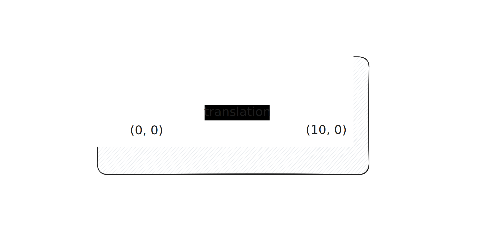

# Mini-test 1

> Pondération : 5% \
> Remise : avant la fin du cours

Concevez la fonction ci-dessous, ainsi que les alias de type
nécessaires. Placez le code dans le fichier `main.ts` inclus dans votre
dépôt. Les tests vous sont déjà donnés (vous ne pouvez pas les
modifier). Pour tester votre code, exécutez la commande `Deno test
main.ts`. La même commande sera utilisée pour la correction.

Une fonction nommée `makeTranslate` qui, étant donnée une distance
horizontale en pixels et une distance verticale en pixels, retourne une
fermeture qui, étant donnée un `point`, translate celui-ci selon les
distances données. Un point est une paire de coordonnées `x` et `y`. La
fermeture doit retourner un nouveau point, et non modifier le point
original sur lequel elle est appliquée.

## Remise

Le programme doit être remis dans un dépôt GitHub Classroom crée à cet
effet. Pour créer le dépôt, cliquez [ici][GitHub Classroom].

[GitHub Classroom]: https://classroom.github.com/a/89UaG3_k
