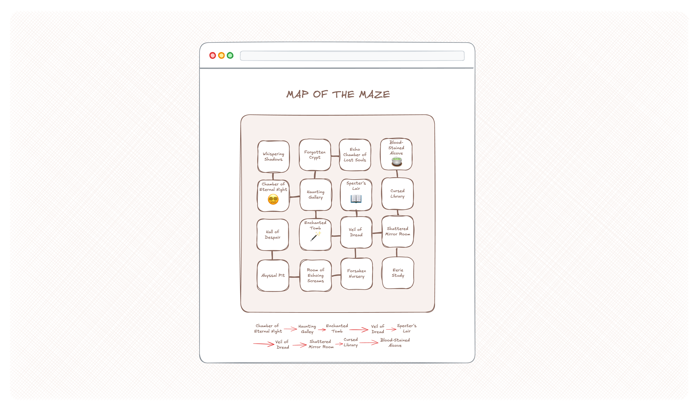

# Projet 2 : Labyrinthe

> Remise : avant le 20 novembre \
> Pondération : 25% \
> Modalité : en équipe de 2


## Introduction

Le fichier `Maze.ts` inclus dans le répertoire `src/lib` de votre dépôt
contient une classe `Maze` qui permet de créer des labyrinthes
aléatoirement.

```ts
const maze = new Maze();
console.log(maze); // => Maze { rooms: Room[], start: Room }
```

### Chambres

Un labyrinthe est un ensemble de 16 chambres représentées par des objets
de type `Room`. Les chambres sont arrangées en une grille 4 × 4, et leur
ordre ne change jamais. La première chambre, par exemple, sera toujours
celle nommée *Whispering Shadows*.

```ts
const room = maze.rooms[0];
console.log(room); // => Room { name: "Whispering Shadows", doors: Door[], item: null }
```

### Items

En plus d'avoir un nom, chaque chambre a une propriété nommée `item` qui
indique quel item se trouve dans celle-ci. Un labyrinthe contient
toujours 3 items : une livre, une baguette magique et une potion.
Ceux-ci sont placés aléatoirement dans 3 chambres différentes. Si une
chambre ne contient pas d'item, la valeur de `item` est `null`.

```ts
const item = room.item;
console.log(item); // => null | "book" | "wand" | "potion" (aléatoire)
```

### Portes

Toutes les chambres ont au moins une porte qui mène à une chambre
voisine. Une porte est représentée par un objet de type `Door`, lequel a
les propriétés `toRoom` qui indique vers quelle chambre mène la porte,
et `direction` qui indique dans quelle direction la porte se trouve
(soit en haut, à droite, en bas, à gauche).

```ts
const door = room.doors[0];
console.log(door); // Door { toRoom: Room, direction "right" } (aléatoire)
```

Les connections entre les chambres sont aléatoires. Toutes les chambres
sont toujours connectées au labyrinthe, et celui-ci ne forme pas de
circuit.

### Point de départ

Enfin, un labyrinthe a une position de départ aléatoire, spécifiée par la
propriété `start`. La valeur de `start` est un objet de type `Room`.

```ts
console.log(maze.start) // Room { ... } (aléatoire)
```

## Tâches

Vous trouverez ci-dessous les tâches à effectuer. Elles sont
divisées en trois étapes.

### Étape 1


Utilisez React pour concevoir une carte du labyrinthe. Pour chaque
chambre, veuillez indiquer son nom et l'item qu'elle contient (s'il y
a). La carte doit également montrer dans quelle chambre se trouve la
position de départ, ainsi que les chemins qui lient les chambres
entre-elles.

Puisque le labyrinthe est aléatoire, l'affichage doit bien entendu être
dynamique. C'est-à-dire qu'une version différente du labyrinthe sera
affichée à chaque fois qu'on rafraîchit la page.

La page doit être divisée en plusieurs composants. Vous pouvez utiliser
HTML ou SVG pour l'affichage du labyrinthe, mais pas l'API canvas, ni
aucune bibliothèque de code externe (outre React et Vite).

### Étape 2



Sur la même page, au dessus ou en dessous de la carte, affichez la route
qui permet, à partir de la position de départ, de récupérer tous les
objets qui se trouvent dans le labyrinthe. Par « route », on entend une
suite de noms des chambres à visiter.

> Abyssal Pit → Hall of Despair → Enchanted Tomb → ...

Tout comme l'affichage du labyrinthe, la route doit être dynamique, et
s'adapter au labyrinthe présentement affiché. Le route doit mener de la
chambre de départ au premier item le plus près, puis au second, et au
troisième. La route peut passer par une même chambre plusieurs fois.

#### Tests unitaires

Le bon fonctionnement du ou des fonctions qui permettent de déterminer
la route doit être validé à l'aide de tests unitaires. Pour ce projet,
vous utiliserez le cadre de test de Deno. Heureusement, l'interface est
exactement la même que celle du cadre utilisé précédemment.

```ts
Deno.test("Doit donner la somme de 1 et 2", () => {
    const actual = 1 + 2;
    const expected = 3;
    expect(actual).toEqual(expected);
});
```

Veuillez placer vos tests dans le fichier `test.ts` qui se trouve déjà
dans votre dépôt. Pour exécuter les tests, utiliser la commande `deno
test`. Celle-ci sera exécutée automatiquement lorsque vous remettrez
le travail, en même temps que `deno fmt --check` et `deno lint`. Vous
serez pénalisé·e si ces commandes produisent des erreurs (ou si vous
n'avez pas de tests unitaires).

### Étape 3


Enfin, ajoutez à la carte du labyrinthe des flèches qui montrent la
route à suivre pour récupérer tous les objets à partir du point de
départ. Chaque flèche doit mener d'une chambre à une autre, et avoir un
sens unique.

## Conseils

-   Un labyrinthe est similaire à un [arbre enraciné][], la même
    structure de données sur laquelle est basée le modèle objet document
    (DOM). Il contient des *nœuds* (les chambres), reliés entre eux par
    des *arêtes* (les chemins). Dans ce contexte, le point de départ est
    la *racine* de l'arbre, et les items sont les *feuilles* à
    atteindre. Une chambre connectée à une seule autre chambre est aussi
    une feuille puisqu'elle n'a pas de nœud enfant.

-   Trouver le premier item le plus près du point de départ est une
    opération similaire à celle de trouver le second item à partir du
    premier. La même opération est similaire à celle de trouver le
    troisième item à partir du second.

-   Traverser un arbre (que ce soit un labyrinthe ou le DOM) est comme
    traverser une liste enchaînée, à la différence qu'un nœud peut avoir
    plusieurs nœuds enfants, alors qu'une paire pointe seulement vers
    une autre paire. Dans les deux cas, « traverser » signifie visiter
    une entité à la fois jusqu'à ce qu'on trouve ce qu'on cherche.

-   Faites des dessins, et observez comment vous (simple humain)
    résolvez ce problème étape par étape. L'algorithme sera similaire.

[arbre enraciné]: https://fr.wikipedia.org/wiki/Arbre_enraciné

## Remise

Le programme doit être remis dans un dépôt GitHub Classroom créé à cet
effet. Pour créer le dépôt, cliquez [ici][GitHub Classroom].

[GitHub Classroom]: https://classroom.github.com/a/pdUFlEhX

### Code inclus

Vous aurez besoin d'importer le module `Maze.ts` inclus dans votre dépôt
afin d'instancier le labyrinthe. Vous pouvez également importer les
classes `Room` et `Door` qui s'y trouvent pour annoter la signature de
vos fonctions. Toutefois, il vous est interdis de modifier tout fichier
se trouvant dans le répertoire `src/lib`.

### Entretien

Une fois le programme soumis, vous devrez expliquer son
fonctionnement et justifier vos choix lors d'un entretien avec
l'enseignant. L'entretien aura lieu le jour suivant la remise. Vous
serez pénalisé·e si vous n'êtes pas présent·e.

### Travail d'équipe

Les membres de l'équipe doivent participer également au travail. Chacun
et chacune devrait être l'auteur ou l'autrice d'un nombre similaire de
*commits*. Aucun parasitisme ne sera toléré. Si vous jugez que votre
coéquipier ou coéquipière ne fait pas sa part, même après lui avoir dit,
veuillez s'il vous plait m'en informer. S'il y a cause, je n'hésiterai
pas à faire échouer la personne en question.
