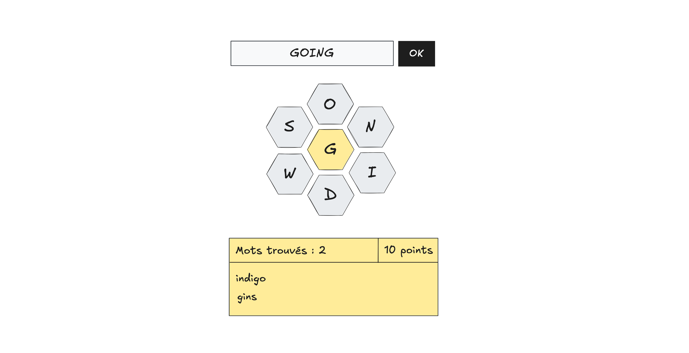

# Projet 3 : Spelling Bee

> Pondération : 30% \
> Remise : avant le dernier cours
> Modalité : en équipe de 2



*Spelling Bee* est un jeu créé par Frank Longo où le but est de former
autant de mots que possible étant donné un ensemble de 7 lettres
présenté sous la forme d'une structure en nid d'abeilles. Le jeu est
disponible sur le [site web du New York Times][NYT]. Pour ce dernier
projet, on vous demande de concevoir une application React qui permet à
un ou une utilisatrice de jouer à *Spelling Bee*.

[NYT]: https://www.nytimes.com/puzzles/spelling-bee

## Règles à implémenter

-   Les mots doivent contenir un minimum de 4 lettres.
-   Les mots doivent inclurent la lettre se trouvant au centre.
-   Les mots doivent être inclus dans la liste donnée.
-   Les lettres peuvent être utilisées plus d'une fois.
-   Les mots valent 1 point par lettre.

## Exigences

-   Les lettres doivent être présentées dynamiquement sous la forme
    d'une structure en nid d'abeilles.
-   L'entrée du mot peut se faire soit à l'aide du clavier, soit en
    cliquant sur les lettres. Si l'on clique sur une lettre, celle-ci
    doit apparaître dans le contrôle pour entrer le mot.
-   L'interface graphique doit inclure les mots trouvés, ainsi que le
    total des points présentement accumulés.

## Tests unitaires

Le bon fonctionnement du ou des fonctions responsables de la validation
et du pointage doit être testé à l'aide de tests unitaires. Pour ce
faire, utilisez le cadre de test de Deno. Heureusement, l'interface est
exactement la même que celle du cadre utilisé précédemment.

```ts
Deno.test("Doit donner la somme de 1 et 2", () => {
    const actual = 1 + 2;
    const expected = 3;
    expect(actual).toEqual(expected);
});
```

Veuillez placer vos tests dans le fichier `test.ts` qui se trouve déjà
dans votre dépôt. Pour exécuter les tests, utiliser la commande `deno
test`. Celle-ci sera exécutée automatiquement lorsque vous remettrez le
travail, en même temps que `deno fmt --check` et `deno lint`. Vous serez
pénalisé·e si ces commandes produisent des erreurs (ou si vous n'avez
pas de tests unitaires).

## Remise

Le programme doit être remis dans un dépôt GitHub Classroom crée à cet
effet. Pour créer le dépôt, cliquez [ici][GitHub Classroom].

[GitHub Classroom]: https://classroom.github.com/a/RO-U170w
